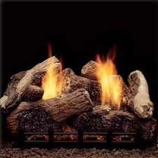

# **Pseudocode Project**

## Gas Fireplace

 

### **Operational Expectations**: The end user should be able to turn the fireplace on or off at any desired time or set the unit to operate based on a desired room temperature. The fireplace will be operated remotely with a wireless remote control.

 
 

# **Important Items**

 

- If the pilot light goes out a device must be installed to automatically shut off the gas to protect the end user from harm.

- A conversion must be built in, to the thermostat, so the unit can be used in multiple markets for Fahrenheit or Celsius temperature readings.

- A safe high temperature setting must be set so an end user cannot accidentally set the temperature above the recommended temperature setting for the fireplace specifications.

- A manual igniter system to ensure the pilot light cannot be lite remotely, ensuring the fireplace has been inspected before the first use of the season.

   
   

# **Object List**

- **End User**

- **Propane/Natural Gas Tank**
  - Manual Gas Valve
  - Gas line fittings

 

- **Gas Line**

  - Manual Gas Valve
  - Electronic Gas Valve
  - Gas line fittings

 

- **Gas Fireplace**

  - Fireplace Insert
  - Gas Burner
  - Decorative Log
  - Rock Wool
  - Manual Control Unit
    - Flame Control Knob
    - Pilot light Control Feature (Push)
  - Pilot light
  - Igniter
    - Igniter Button
  - Thermocouple
  - Remote infrared/Bluetooth sensor unit

 

- Wireless Remote Control

  - Digital display: Displays the current ambient room temperature.

  - Thermostat: Senses the ambient room temperature and turns the fireplace on or off if it is set.

  - Buttons

    - On button: Turns the fireplace on, to the current flame setting.

    - Off button: Turns the fireplace off.

    - Mode button: Cycles between manual operation and thermostat mode

    - Set button: Sets the temperature for the thermostat.

    - Batteries: Two (2) triple (AAA) batteries provide power to the remote. **Note**: first set of batteries will be provided to end user, all replacements will be the responsibility of the end user.

 
 

# **Objects, Functions, & Dependencies**

 

- ### **Gas Tank object**: Purchased and provided by the End user.

  - Stores the fuel for the Gas Fireplace object.

  - Connects to the Gas Line Object with a Gas Line Fitting

  - Manual gas valve: CONTROLS the flow of gas from the Gas Tank Object to the Gas Fireplace Object.

    - IF valve is turned all the way to the right THEN gas is off.

    - IF valve is turned all the way to the left THEN gas is on.

 

- ### **Gas Line Object**: Purchased and installed by End user.

  - Supplies the gas from the Gas Tank Object to the Gas Fireplace Object.

  - Connects to the Gas Tank Object with a Gas Line Fitting.

  - Manual/Electronic gas valve: CONTROLS the flow of gas from the tank.

    - IF valve is turned all the way to the right OR the Thermocouple Object is not sending an electric signal THEN gas is off.

    - IF valve is turned all the way to the left AND Thermocouple Object is sending an electric signal THEN gas is on.

  - Connects to the Gas Burner Object was a Gas Line Fitting Object.

 

- ### **Gas Fireplace Object**: Main object containing several sub-components working together to operate as one main object.

  - #### **Fireplace Insert Object**: A metal frame mounted inside the wall to safely house the Gas Fireplace Object's sub-components. All objects listed below, except the remote will be housed in the Fireplace Insert Object.

  - #### **Gas Burner Object**:

    - Location where flames are generated by the burning of gas.

    - Sits in the bottom of the Fireplace Insert Object.

    - Connects to the Gas Line Object with a Gas Line Fitting Object.

    - Holds the Decorative Log Object which provides the look of an authentic fire.

    - The Rock Wool Object sits in the bottom of the Fireplace Insert Object in front of and on top of the Gas Burner Object to provide the appearance of glowing embers.

    - The Manual Control Unit Object CONTROLS the volume of the flame produced by the Gas Burner Object.

      - The Flame Control Knob will provide a minimum and maximum amount the flame can be adjusted.

      - IF Flame Control Knob is LESS THAN 50% THEN the Gas Burner Object will produce a flame volume LESS THAN 50% capacity.

      - IF Flame Control Knob is GREATER THAN 50% THEN the Gas Burner Object will produce a flame volume GREATER THAN 50% capacity.

    - The Igniter Object mounts to the Gas Burner Object assembly and electric power. It produces an electric spark to ignite the gas in the Pilot light Object.

      - IF electric is connected on THEN ONCLICK Igniter Button Object will produce an electric spark.

    - The Pilot light Object is connected to the Gas Burner Object and lite by the Igniter Object.

      - Gas flow to the Pilot light Object is controlled by the Flame Control Knob Object.

      - PUSH down AND HOLD the Flame Control Knob to allow gas to flow to Pilot light Object.

      - IF Pilot light Object has gas flow THEN PUSH Igniter Button Object.

        - Is Pilot light Object lit?

        - IF not CONTINUE to HOLD down Flame Control Knob AND PUSH Igniter Button Object.

        - Pilot light Object lit RELEASE Flame Control Knob.

    - Thermocouple Object is connected to the Pilot light Object and the Electric Gas valve Object.

      - The Thermocouple Object provides a small electrical signal to the Electric Gas valve Object instructing it to stay open or closed.

      - IF Thermocouple Object is GREATER THAN a certain temperature THEN keep Electronic Gas valve Object open.

      - IF Thermocouple Object is LESS THAN a certain temperature THEN close Electronic Gas Valve Object.

    - Electric Gas valve Object is connected the the Gas line Object and the Thermocouple Object.

      - The control of gas by the valve is dependent on a small electrical signal received by the Thermocouple Object described above.

      - Its main function is a fail safe to prevent unused gas from entering the home and harming the end user.

    - Remote infrared/Bluetooth sensor Object is connected to the Manual Control Unit and acts as an interface between the Manual Control Unit Object and the Wireless Remote Control Object.
