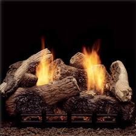

# **Pseudocode Project**

## Gas Fireplace

 

### **Operational Expectations**: The end-user will be able to turn the fireplace on or off at any desired time or set the unit to operate based on the desired room temperature. The fireplace controls are manual or remote via wireless remote control.

 
 

# **Important Items**

 

- If the pilot light goes out, a device must be installed to automatically shut off gas flow to protect the end user from harm.

- The thermostat must have a conversion option so the unit will work in multiple markets. (Fahrenheit / Celsius)

- A safe, high-temperature setting must be set so an end-user cannot accidentally set the temperature above the recommended temperature setting for the fireplace specifications.

- A manual igniter system to ensure the pilot light cannot be lit remotely, ensuring the fireplace has been inspected before the first use of the season.

   
   

# **Object List**

- **End User**

- **Propane/Natural Gas Tank**
  - Gas Tank Valve
  - Gas line fittings

 

- **Gas Line**

  - Manual Burner Gas Valve
  - Gas line fittings

 

- **Gas Fireplace**

  - Fireplace Insert
  - Gas Burner
  - Decorative Log
  - Rock Wool
  - Control Unit
    - Three Way Switch
    - Flame Control Knob
    - Pilot light Control Feature (Push)
    - Electronic Controlled Gas Valve
    - Remote Infrared/Bluetooth Sensor
  - Pilot light
  - Igniter
    - Igniter Button
  - Thermocouple
      

- Wireless Remote Object
  - Digital display
  - Thermostat
  - Buttons
    - On button
    - Off button
    - Mode button: Cycles between manual operation and thermostat mode - Set button: Sets the temperature for the thermostat. 
    - Batteries: Two (2) triple (AAA) batteries provide power to the remote. **Note**: first set of batteries will be provided to end user, all replacements will be the responsibility of the end user.
      

# **Objects, Functions, & Dependencies**

- ### **Gas Tank object**:

  - Purchased and provided by the end-user.

  - Gas Tank Object STORES gas for Gas Fireplace object.

  - Gas Tank Object CONNECTS to Gas Line Object with Gas Line Fitting.

      

- ### **Manual gas valve**:

  - Part of the Gas Tank Object (Purchased by end-user)

    - **FUNCTION**: CONTROLS the flow of gas from the Gas Tank Object to Gas Line Object.

      - IF user TURNS Manual Gas Tank valve to the right

      - THEN gas WILL NOT flow.

      - IF user TURNS Manual Gas Tank valve to the left

      - THEN gas WILL flow.

  

- ### **Gas Line Object**:

  - Purchased by end-user and installed by licensed professional.

  - SUPPLIES gas from Gas Tank Object to Gas Fireplace Object.

  - Gas Line Object CONNECTS to Gas Burner Object with Gas Line Fitting.

      

- ### **Manual Burner Gas valve**:

  - Purchased by end-user and installed by licensed professional. IManual Operation)

    - **FUNCTION**: CONTROLS the flow of gas from Gas line Object to Gas Burner Object.

      - IF end-user TURNS Manual Burner Gas valve to right

      - THEN gas WILL NOT flow.

      - IF end-user TURNS Manual Burner Gas valve to left

      - THEN gas WILL flow.

      

- ### **Gas Fireplace Object**:

  - Main object containing sub-components working together to operate as one object.

  - #### **Fireplace Insert Object**:

    - A metal frame mounted inside a wall to safely house Gas Fireplace Object.

      

  - ### **Control Unit Object**:

    - Three Way Switch Object:

      - CONNECTS to electric power.

      - **FUNCTION**: CONTROLS electric power to the Control Unit Object.

        - IF switch is set to OFF

        - THEN no electric power to Control Unit Object.

        - IF switch is set to REMOTE AND Wireless Remote Object On Button NOT CLICKED

        - THEN no electric power to Control Unit Object.

        - IF switch is set to REMOTE AND Wireless Remote Object On Button CLICKED

        - THEN electric power SENT to Control Unit Object.

        - IF switch set to ON

        - THEN electric power to Control Unit Object.

    - Remote Infrared/Bluetooth Sensor Object:

      - **FUNCTION**: RECEIVES wireless signals from the Wireless Remote Object to remotely ACCESS the Control Unit Object.

        - IF Remote Sensor HAS electric power (in case infrared add AND sensor is not COVERED)

        - THEN Remote Sensor can receive Wireless Remote signal

        - IF Remote Sensor DOES NOT HAVE electric power (in case of infrared add OR sensor is COVERED)

        - THEN Remote Sensor cannot receive Wireless Remote signal

    - **FUNCTION**: CONTROLS the volume of the flame produced by the Gas Burner Object.

      - Flame Control Knob Object provides a minimum and maximum amount the flame can be adjusted.

      - IF Flame Control Knob is LESS THAN 50%

      - THEN Gas Burner Object will produce flame LESS THAN 50% capacity.

      - IF Flame Control Knob is GREATER THAN 50% THEN

      - Gas Burner Object will produce flame GREATER THAN 50% capacity.

    - **FUNCTION**: CONTROLS the flow of gas from Gas Line Object to Gas Burner Object AND Pilot Light Object, by manually holding open the Electronic Controlled Gas Valve.

      - IF end-user PUSHES Flame Control Knob OPENING Electronic Controlled Gas Valve

      - THEN gas WILL flow to Pilot Light Object.

  

- ### **The Igniter Object**:

  - ATTACHES to Gas Burner Object AND CONNECTS to electric power.

  - **FUNCTION**: PRODUCES an electric spark.

  - IF electric is CONNECTED AND end-user PUSHES Igniter Button

  - THEN Igniter Object will produce an electric spark.

  

- ### **Pilot light Object**:

  - ATTACHES to the Gas Burner Object next to the Igniter Object.

  - **FUNCTION**: CONTINUOUS small flame to prevent unburnt gas from entering the living area and ease of lighting when desired.

    - To light Pilot Light Object USE Flame Control Object PUSH FUNCTION AND Igniter Object FUNCTION SIMULTANEOUSLY.

  

- ### **Thermocouple Object**:

  - ATTACHES to the Pilot Light Object directly above the flame.

  - **FUNCTION**: MEASURES temperature output of the Pilot Light Object and produces an electric signal based on that output to be sent to the Electronic Controlled Gas Valve.

    - IF Thermocouple Object MEASURES temperature GREATER THAN specified temperature

    - THEN electric signal sent to Electronic Controlled Gas Valve.

    - IF Thermocouple Object MEASURES temperature LESS THAN specified temperature

    - THEN NO electric signal sent.

  

- ### **Electronic Controlled Gas Valve Object**:

  - Part of the Control Unit Object (internal component), must connect to electric power.

  - **FUNCTION**: CONTROLS the flow of gas from the Gas Line Object to the Pilot Light Object and the Gas Burner Object.

    - To manually operate for temporary gas flow use the Flow Control Knob Object PUSH FUNCTION.

    - For valve to stay open it must receive an electric signal from the Thermocouple FUNCTION

  - **FUNCTION**: ALLOW gas glow if power failure.

    - IF Pilot Light Object is lit AND Electronic Controlled Gas Valve Object receives signal from Thermocouple Object

    - THEN gas WILL flow to Gas Burner Object.

  

- #### **Gas Burner Object**:

  - Sits in the bottom of the Fireplace Insert Object.

  - Decorative Log Object SITS on top of Gas Burner Object to provide the look of an authentic fire.

  - Rock Wool Object SITS in the front bottom of the Fireplace Insert Object AND on top of the Gas Burner Object to provide the appearance of glowing embers.

  - **FUNCTION**: GENERATE flame from burning gas.

    - CONNECTS to:

      - Pilot Light Object
      - Thermocouple Object
      - Igniter Object
      - Control Unit Object
      - Gas Line Object
      - Remote infrared/Bluetooth Sensor Object

    - To INITIATE the Gas Burner Object

  

### **Wireless Remote Object**:

- NOTE: Two (2) triple A batteries should be shipped with unit, however, all additional should be responsibility of end-user.

  - ### **Digital Display Object**:

    - **FUNCTION**: DISPLAYS the following

      - IF Gas Fireplace Object is on

      - THEN DISPLAY 🔥

      - IF Wireless Remote Object HAS power

      - THEN DISPLAY current room temperature

      - IF Wireless Remote Object is set to thermostat mode

      - THEN DISPLAY the word SET

      - IF Gas Fireplace Object is on AND set to manual mode

      - THEN DISPLAY the word TEMP

      - IF On Button is PUSHED on Wireless Remote Object 

      - THEN DISPLAY the word ON

      - IF Off Button is PUSHED on Wireless Remote Object 

      - THEN DISPLAY the word OF

